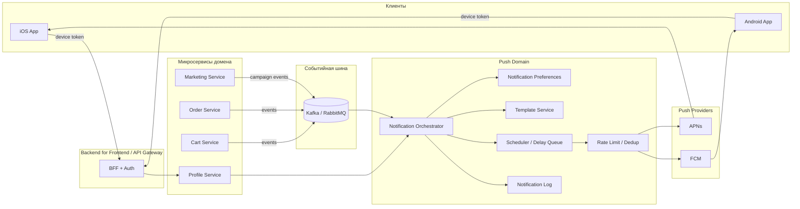

# Тестовое задание — «Петрушка Зеленая»

## Задание 1. Анализ требований

### 1) Противоречия и недочеты в исходном фрагменте ТЗ

1. **Пункт 2 противоречит пункту 9**.
   - П.2: количество можно менять не менее чем до 1, удаление — отдельной кнопкой.
   - П.9: при уменьшении до 0 товар удаляется.
   - Проблема: две разные модели удаления товара из корзины.

2. **Пункт 7 противоречит пункту 13**.
   - П.7: цена фиксируется в момент добавления и не меняется.
   - П.13: цена должна автоматически обновляться в корзине при изменении в каталоге.
   - Проблема: невозможно одновременно фиксировать и автоматически обновлять одну и ту же цену.

3. **Пункт 1 сформулирован неполно по контексту “добавления”**.
   - Неясно, ограничение 1–10 относится к одному действию добавления или к итоговому количеству позиции в корзине.
   - Проблема: различное поведение фронтенда и бэкенда в edge-case (например, в корзине уже 9 шт., пользователь нажимает «+3»).

4. **Пункт 6 слишком общий и не покрывает сценарий изменения количества**.
   - Сообщение задано только для “попытки добавить”, но лимиты нарушаются и при редактировании количества.
   - Проблема: не определено единообразное поведение ошибок.

5. **Пункт 5 не несет требований**.
   - “Товары в корзине могут быть разные” фактически дублирует здравый смысл и не задает валидацию.
   - Проблема: “шум” в ТЗ и отсутствие конкретики.

6. **Пункты 10–11 про рекламу не имеют критериев реализации**.
   - Не определено, что означает “должна быть каждый будний день по утрам и вечерам”: чьи часовые пояса, точные интервалы, обязательность показа, частота обновления, таргетинг.
   - Проблема: невозможно разработать и тестировать без однозначных правил.

7. **Нумерация пунктов нарушена (отсутствует пункт 12)**.
   - Проблема: признак неаккуратности и риск рассинхронизации ссылок на требования в задачах/тестах.

8. **Нет приоритета лимитов и текста ошибок при одновременном нарушении нескольких ограничений**.
   - Например, при добавлении товара одновременно превышаются “5 разных” и “20 суммарно”.
   - Проблема: неодинаковые ответы API и UX в одинаковых сценариях.

9. **Не определена область действия корзины**.
   - Гость/авторизованный пользователь, срок жизни корзины, объединение корзин после логина.
   - Проблема: архитектурные и продуктовые расхождения.

10. **Не определены правила округления/формат цен в отображении общей стоимости (п.8)**.
   - Проблема: расхождение итоговых сумм на клиенте и сервере.

---

### 2) Исправленная версия фрагмента ТЗ (непротиворечивая)

#### Раздел: Функционал корзины

1. В корзине допускается от **1 до 10 единиц одного SKU** (товарной позиции).
2. Пользователь может изменять количество товара в диапазоне **1..10** с шагом 1.
3. Удаление товара из корзины выполняется:
   - либо отдельной кнопкой «Удалить»,
   - либо установкой количества в 0 (эквивалент кнопки «Удалить»).
4. В корзине может быть не более **5 различных SKU**.
5. Суммарное количество единиц всех товаров в корзине не может превышать **20**.
6. При нарушении лимитов на добавление или изменение количества система возвращает ошибку `CART_LIMIT_EXCEEDED` и человекочитаемое сообщение:
   - «Превышен лимит 10 единиц на товар»,
   - «В корзине может быть не более 5 разных товаров»,
   - «Суммарно в корзине не более 20 товаров».
7. При одновременном нарушении нескольких лимитов система возвращает первую ошибку по приоритету:
   1) лимит на SKU (10),
   2) лимит уникальных SKU (5),
   3) лимит общего количества (20).
8. На странице корзины отображаются: название товара, количество, цена за единицу, общая стоимость позиции (`qty * unit_price`), итоговая сумма корзины.
9. **Ценообразование:** цена в корзине фиксируется на момент добавления товара и не изменяется автоматически до оформления заказа или явного обновления корзины пользователем.
10. В корзине допускается блок рекламных предложений партнеров. Рекламный блок не влияет на состав, стоимость и лимиты корзины.
11. Расписание показа рекламы: в будние дни по часовому поясу пользователя:
   - утро: 08:00–11:59,
   - вечер: 18:00–21:59.
12. Для каждого рекламного блока обязательны поля: `title`, `image_url`, `click_url`, `valid_from`, `valid_to`.

---

### 3) Уточняющие вопросы к продукт-менеджеру/бизнес-заказчику

1. Корзина хранится отдельно для гостя и авторизованного? Что делать при логине (слияние корзин)?
2. Лимит 10 единиц — на SKU или на товар с учетом вариантов (вес, фасовка, цвет)?
3. Допускаются дробные количества (например, 0.5 кг) или только целые штуки?
4. Если товар стал недоступен, как ведет себя корзина (скрыть, пометить, удалить)?
5. Нужна ли “мягкая” фиксация цены (с переоценкой перед чекаутом) или строгая фиксация до оплаты?
6. Какие валюты/форматы цен поддерживаем, правила округления, НДС включен?
7. Должны ли лимиты зависеть от категории товара или быть глобальными?
8. Какие тексты ошибок нужны по платформам (iOS/Android/Web), нужна ли локализация?
9. Нужна ли аналитика событий по корзине (add/remove/change_qty/error)?
10. Есть ли A/B-тесты рекламы в корзине, ограничение частоты показа, персонализация?
11. Что считать “будним днем” и “утром/вечером” для пользователей в разных часовых поясах?
12. Должен ли рекламный блок подгружаться независимо от корзины (отказоустойчивость при сбое ad-сервиса)?

---

## Задание 2. Проектирование REST API

### Пример запроса при открытии экрана «Выберите магазин»

```http
GET /api/v1/partner-stores?lat=55.7558&lon=37.6176&limit=20&platform=ios&app_version=2.14.0 HTTP/1.1
Host: app.petrushka-green.ru
Authorization: Bearer <access_token>
Accept: application/json
X-Request-Id: 9f6e6f7d-4d2b-4e1d-8a55-3b8fdc11a001
```

### Пример ответа

```json
{
  "screen_title": "Выберите магазин",
  "generated_at": "2026-02-21T10:30:00Z",
  "user_location": {
    "lat": 55.7558,
    "lon": 37.6176
  },
  "stores": [
    {
      "id": "metro",
      "name": "METRO",
      "logo_url": "https://cdn.petrushka-green.ru/partners/metro.png",
      "delivery_label": "Ближайшая доставка сегодня 21:00–23:00",
      "delivery_type": "slot",
      "delivery_window": {
        "from": "2026-02-21T21:00:00+03:00",
        "to": "2026-02-21T23:00:00+03:00"
      },
      "deeplink_url": "https://partner.metro.example.com/deeplink?ref=petrushka",
      "is_available": true,
      "priority": 1
    },
    {
      "id": "auchan",
      "name": "Ашан",
      "logo_url": "https://cdn.petrushka-green.ru/partners/auchan.png",
      "delivery_label": "Ближайшая доставка сегодня 18:00–20:00",
      "delivery_type": "slot",
      "delivery_window": {
        "from": "2026-02-21T18:00:00+03:00",
        "to": "2026-02-21T20:00:00+03:00"
      },
      "deeplink_url": "https://partner.auchan.example.com/start?utm_source=petrushka",
      "is_available": true,
      "priority": 2
    },
    {
      "id": "vkusvill",
      "name": "ВкусВилл",
      "logo_url": "https://cdn.petrushka-green.ru/partners/vkusvill.png",
      "delivery_label": "Быстрая доставка от 20 до 60 минут",
      "delivery_type": "asap",
      "delivery_eta_minutes": {
        "min": 20,
        "max": 60
      },
      "deeplink_url": "https://partner.vkusvill.example.com/open",
      "is_available": true,
      "priority": 3
    },
    {
      "id": "victoria",
      "name": "ВИКТОРИЯ",
      "logo_url": "https://cdn.petrushka-green.ru/partners/victoria.png",
      "delivery_label": "Ближайшая доставка сегодня 17:00–19:00",
      "delivery_type": "slot",
      "delivery_window": {
        "from": "2026-02-21T17:00:00+03:00",
        "to": "2026-02-21T19:00:00+03:00"
      },
      "deeplink_url": "https://partner.victoria.example.com/landing",
      "is_available": true,
      "priority": 4
    }
  ]
}
```

---

## Задание 3. Верхнеуровневая архитектура PUSH-уведомлений

Ниже — вариант блок-схемы для микросервисного бэкенда.



### Краткое описание потока

1. Мобильное приложение регистрирует push-token (APNs/FCM) через BFF.
2. Доменные сервисы (корзина, заказ, маркетинг) публикуют события в шину.
3. Notification Orchestrator подписывается на события, вычисляет сценарий отправки (триггерный, отложенный, рекламный).
4. Перед отправкой применяются пользовательские настройки, дедупликация, rate limit и quiet hours.
5. Провайдер-адаптеры отправляют push в APNs/FCM.
6. Результаты доставки и статусы пишутся в Notification Log для мониторинга, ретраев и аналитики.

### Минимальные типы событий для старта

- `cart.abandoned` (корзина без действий X минут)
- `order.cancelled`
- `order.status_changed`
- `marketing.campaign.started`

### Нефункциональные требования (рекомендуемо)

- Идемпотентность отправки (`event_id` + `user_id` + `template_id`).
- Гарантия “at-least-once” в очереди + дедуп на стороне Orchestrator.
- SLA отправки триггерных push (например, до 30 секунд).
- Централизованные шаблоны, локализация, A/B версии текста.
- Возможность отключить рекламные push отдельно от транзакционных.

